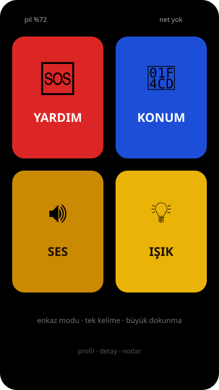
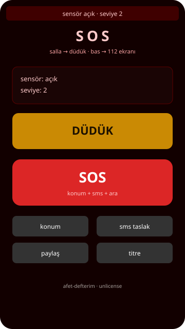
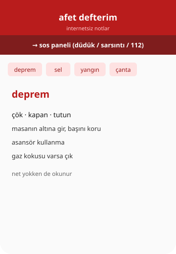

# afet-defterim

<p align="center">
  
</p>

<p align="center">
  
  &nbsp;
  
</p>

<p align="center">
  <strong>enkaz modu · internetsiz acil</strong><br/>
  🆘 yardım · 📍 konum · 🔊 ses · 💡 ışık<br/>
  <code>unlicense</code>
</p>

---

## ne işe yarar?

telefonu enkaz / karanlık / panikte açınca **4 büyük düğme**. uzun metin yok.

| düğme | ne yapar |
|--------|----------|
| **YARDIM** | konum + hazır sms + `tel:112` (+ kayıtlı acil kişiye sms taslağı) |
| **KONUM** | gps al, paylaş / kopyala |
| **SES** | yüksek düdük (tekrar bas = kapat) |
| **IŞIK** | flaş (torch) veya tam ekran beyaz |

önce **profil**’den kan grubu, not, 2–3 acil kişi kaydet (telefonda kalır, net gerekmez).

alt sayfalar: notlar (enkaz, deprem sonrası, yangın, sel, çanta, çocuk kartı…), checklist, detaylı sos.

**sınır:** tarayıcı senin yerine 112 aramaz; onay sende.

---

## kurulum

```bash
git clone https://github.com/just-ulas/afet-defterim.git
cd afet-defterim
python3 -m http.server 8000
```

| | adres |
|--|--------|
| enkaz (ana) | http://localhost:8000/**enkaz.html** |
| profil | http://localhost:8000/profil.html |
| notlar | http://localhost:8000/index.html |

telefonda aynı wifi → `http://BILGISAYAR-IP:8000/enkaz.html`

### pwa (sağlam taraf)

- `manifest.json` → `start_url: enkaz.html`, standalone
- service worker **v5**: precache kritik html/css/js/notlar
- **stale-while-revalidate** + offline fallback → `enkaz.html`
- güncelleme: yeni sürümde banner → **yenile** (`SKIP_WAITING`)

android chrome / ios safari → ana ekrana ekle.

---

## sarsıntı algılama

eski sürüm yürürken de tetiklenebiliyordu. artık:

- yerçekimsiz ivme tercih
- tepe (peak) sayımı — tek adım ≈ 1 tepe → reddedilir
- süre eşiği (sustained)
- modlar: `hassas` / `normal` / **`sert`** (enkaz varsayılanı)

hâlâ sismograf değil; sadece telefon hareketi.

---

## offline kritik içerik

`notlar/` cache’te:

- enkaz altı
- deprem / sonrası
- yangın, sel
- ilk yardım, çanta
- çocuk afet kartı
- tahliye, iletişim

`profil.html` → kan grubu, alerji notu, acil kişiler.

---

## ekranlar

```text
enkaz.html     ← ana (4 düğme)
profil.html    ← kan / kişiler / not
sos.html       ← detaylı düdük + sensör
index.html     ← rehber notları
checklist.html ← hazırlık listeleri
```

---

## uyarı

112 sadece gerçek acilde. bu resmi AFAD uygulaması değil.

[unlicense](LICENSE)
