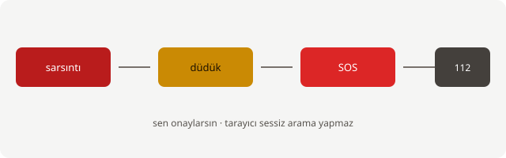

# afet-defterim

<p align="center">
  
  &nbsp;
  
</p>

<p align="center">
  
</p>

<p align="center">
  <strong>internetsiz acil durum notları + sos paneli</strong><br/>
  düdük · sarsıntı algılama · konum · 112 yönlendirme · checklist<br/>
  <code>unlicense</code> — ne istersen yap
</p>

---

## bu ne işe yarıyor?

telefonda / tablette **net olmadan** açabileceğin bir afet defteri.

| ekran | ne yapar |
|--------|----------|
| **sos.html** | büyük düdük, telefon sallanınca ses, sos butonu (konum + sms taslağı + `tel:112`) |
| **index.html** | deprem, sel, yangın, çanta… kısa notlar |
| **checklist.html** | hazırlık listeleri, işaretler telefonda kalır |

**bilerek sınırlı:** tarayıcı 112’yi senin yerini arayamaz. sos ekranı açar, onayı sen verirsin. bluetooth ile rastgele telefona mesaj webden olmaz — paylaş / sms yedek.

---

## kurulum (30 saniye)

```bash
git clone https://github.com/just-ulas/afet-defterim.git
cd afet-defterim
python3 -m http.server 8000
```

| cihaz | adres |
|--------|--------|
| aynı bilgisayar | http://localhost:8000/sos.html |
| telefon (aynı wifi) | http://**bilgisayar-ip**:8000/sos.html |

> `file://` ile açınca sensör / ses / fetch kapris yapabilir. sunucu kullan.

### ana ekrana ekle (pwa hissi)

android chrome → menü → ana ekrana ekle  
ios safari → paylaş → ana ekrana ekle

---

## hızlı kullanım

1. **sensörü aç** → izin ver  
2. telefonu salla → düdük (eşik düşük tutuldu, adımda da tetiklenebilir)  
3. **düdük** basılı tut  
4. **sos** → konum + mesaj + 112 ekranları (sen onayla)

```text
sarsıntı ──► düdük ──► SOS ──► sms / tel:112
                              (kullanıcı onayı)
```

---

## klasörler

```text
sos.html checklist.html index.html
kod/           ses, sarsıntı, acil, md, depo, checklist…
notlar/        markdown rehberler
veri/          checklist json, ipuçları
docs/ekran/    svg mockup (readme görselleri)
stil/          css
scripts/       ipucu üretici
test/          küçük node testleri
```

---

## test

```bash
node test/md.test.js
node test/konum-format.test.js
```

---

## uyarı

- 112’yi **sadece gerçek acilde** ara  
- bu tıbbi / resmi AFAD kılavuzu değil  
- resmi talimat her zaman öncelikli

---

## lisans

[unlicense](LICENSE) — kamu malı.

issue aç, fork at, kır, dağıt.
